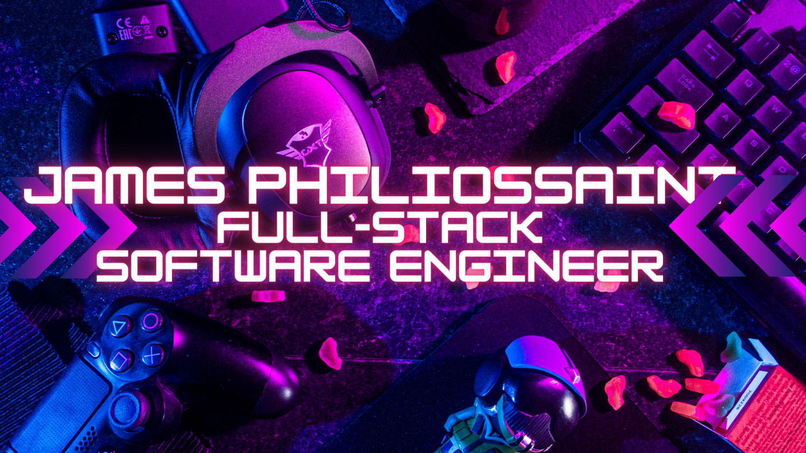

    
    
    
    
    
  

  
  What's Up? I'm James Philiossaint, an esports commentator turned full-stack software engineer. Programming is the tool of an efficient lazy soul.
  
  Visit [my website](https://jamesphiliossaint.netlify.app/) to get to know more about me and my projects!
  
  
  <h1 align="center">Projects</h1>
  <table bordercolor="#66b2b2">
  
  <tr>
    <td width="50%" valign="top">
      <h3 align="center">Anime Quote Generator</h3>
         
        
         
        

          
    
  
      

        
<strong>Javascript, HTML5, CSS3</strong> - Enter your favorite anime and get back a quote! Made using two APIs.

    </td>
    <td width="50%" valign="top">
      <h3 align="center">GamerTag Generator</h3>
         
      
         
        

          
  
  
      

        
<strong>Javascript,CSS, & HTML5</strong> - A GamerTag Generator that uses the users answers to randomly generate a GamerTag for them!.

    </td>
  </tr>
  
  <tr>
    <td width="50%" valign="top">
      <h3 align="center">NASA API</h3>
       
        
       
        

  
  
      

        
<strong>HTML5, CSS3, & Javascript</strong> - Site that fetch's JSON from NASA's api to display either the video or picture of the day.

    </td>
    <td width="50%" valign="top">
      <h3 align="center">Portfolio Site</h3>
         
        
         
        

          
  
  
      

        
<strong>HTML5, CSS3, & Javascript</strong> -Portfolio Site including links to my projects and ways to get in contact with me.!

    </td>
  </tr>
</table>
  
  
  <h1 align="center">Technologies</h1>
  
  
  

      
      
      
      
      
      
      
      
      
      
    
  

  
  
  
  ---
  
  
  <h1 align="center">Connect</h1>
  
  
  
  

    
    
    
    
    
  

  
